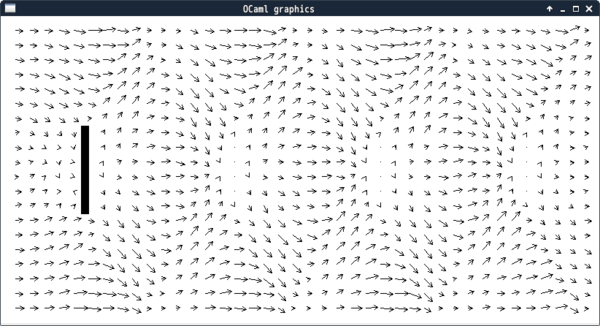
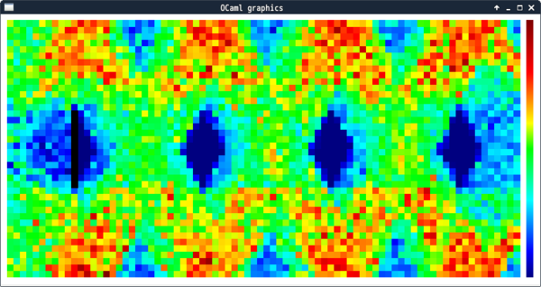

Simple fluid simulator in OCaml
=============================

This is a simple fluid simulator by
[lattice gas automaton](https://en.wikipedia.org/wiki/Lattice_gas_automaton)
in OCaml.

```
$ make
$ ./simulate.out
```




